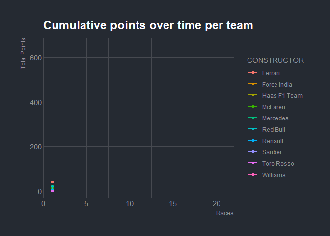
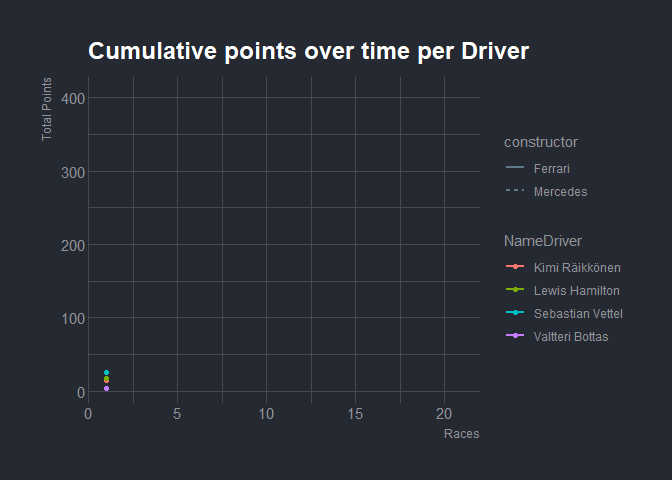

Formula 1 season 2018 : Dataset manipulation and visualization using
tidyverse and gganimate package
================

### Data collection

The data was downloaded from ergast.com in the form of a single large
JSON file which contains information on the results of all 21 races from
the 2018 season.

### Tidy the data (RDS to tidy dataframe)

``` r
#load the data
f1 = readRDS(file="data/f1_2018.rds")
```

#### Tidying Process

The `f1` object is imported as a deeply nested list object in R. Only
the list named `Races` was used as it contained all the relevant
information. An extraction function was used to pull the relevant data
from this list. This extraction function was used in conjunction with
the map function from the `purrr` package in R. Essentially the map
function pushes each list entry in Races as an argument to the
extraction function. The extraction function is written in a way such
that it expects each `Races` entry to be passed to it one at a time. The
map function will loop over all entries.

Most of the data were extracted using the `$` symbol. To convert the
data into the appropriate type the function `as.` was used. Moreover,
the transpose function from the `purrr` package works particularly well
in lists when one needs to extract data over multiple list entries.
Rather than using a loop, one can transpose the list then extract the
relevant data using the $ or \]\] notation.

To create the column of the position of the drivers in each race the
`PositionText` object was checked whether its value was ‘R’ or not(
PositionText equal to ‘R’ means that the driver should be considered as
he finished the race).Then a vector with boolean elements was
created.Finally `ifelse` was used to create the position column.`ifelse`
passes iteratively through all elements of boolean and fills the
position vector with the position of the driver or with an NA
accordingly.

The `extraction function` will return a tibble data frame with 20 rows
and 7 columns. Note that to get this data frame we are exploiting the
fact that `tibble` would repeat values of shorter lists. In this case,
NameRace, round and date have length 1 but all other columns has length
20. Given the fact that the first 3 columns are the same for all of the
Drivers, we want these values to be repeated.

The map function will,therefore,return a list object where each entry in
the list is 21x7 data frame(1 data frame per race). These data frames
need to be concatenated together “vertically” in order to produce a
single data frame object. The reduce function from `purrr` recursively
applies a function to a list object. The function applied recursively
was bind\_rows. This produces the desired data frame.

``` r
extraction_function <- function(entry){
  #Extract Relevant Data for each list entry
  NameRace <- entry$raceName
  round <- as.integer(entry$round)
  date <- as.Date(entry$date)
  surname <-entry$Results %>% purrr::transpose() %>%
            .[["Driver"]] %>% purrr::transpose()%>%
            .[["familyName"]] %>% unlist()
  NameDriver <- entry$Results %>% purrr::transpose() %>%
                .[["Driver"]] %>% purrr::transpose()%>%
                .[["givenName"]] %>% unlist() %>% str_c(.,surname,sep=" ")
  boolean <- entry$Results %>%purrr::transpose() %>%
             .[["positionText"]] %>% unlist()!="R"
  position = ifelse(boolean,entry$Results %>%purrr::transpose() %>%
             .[["position"]] %>% unlist(),NA)
  constructor <- entry$Results %>% purrr::transpose()%>%
                 .[["Constructor"]] %>% purrr::transpose()%>% .[["name"]]%>%                       unlist()
  
  points <- entry$Results %>%purrr::transpose() %>%
            .[["points"]] %>% unlist()
  
  #Return A DataFrame To be concatenated vertically
  return(
    tibble(
      NameRace = NameRace,
      Round = round,
      date = date,
      NameDriver = NameDriver,
      position = as.integer(position),
      constructor = constructor,
      points = as.integer(points)
    )
  )
}

formula <- f1[["MRData"]][["RaceTable"]][["Races"]]
#Create a dataframe for each entry and then concatenated “vertically”
f1_tidy <- map(formula,.f = extraction_function) %>% 
           reduce(.f = bind_rows) 
f1_tidy[1:10,]
```

    ## # A tibble: 10 x 7
    ##    NameRace          Round date       NameDriver     position constructor points
    ##    <chr>             <int> <date>     <chr>             <int> <chr>        <int>
    ##  1 Australian Grand~     1 2018-03-25 Sebastian Vet~        1 Ferrari         25
    ##  2 Australian Grand~     1 2018-03-25 Lewis Hamilton        2 Mercedes        18
    ##  3 Australian Grand~     1 2018-03-25 Kimi Räikkönen        3 Ferrari         15
    ##  4 Australian Grand~     1 2018-03-25 Daniel Riccia~        4 Red Bull        12
    ##  5 Australian Grand~     1 2018-03-25 Fernando Alon~        5 McLaren         10
    ##  6 Australian Grand~     1 2018-03-25 Max Verstappen        6 Red Bull         8
    ##  7 Australian Grand~     1 2018-03-25 Nico Hülkenbe~        7 Renault          6
    ##  8 Australian Grand~     1 2018-03-25 Valtteri Bott~        8 Mercedes         4
    ##  9 Australian Grand~     1 2018-03-25 Stoffel Vando~        9 McLaren          2
    ## 10 Australian Grand~     1 2018-03-25 Carlos Sainz         10 Renault          1

### Construction of a table showing the World Drivers’ Championship standings for this F1 season.

In order to get the desired data frame our original data frame was first
grouped by `NameDriver`.Then using the `mutate` function a new column
was created which was filled with the sum of each driver in all races.
Finally, in order to create a data frame with its columns been the names
of the Races with values from the corresponding driver’s position,in
each race,the `pivot_wider` function was used. `arrange` function was
used at the end to sort the result. Note that the columns of the races
are in chronological order due to the structure of our data frame that
was created in task 1 and the way `pivot_wider` works.

``` r
  Drivers=f1_tidy%>%
          group_by(NameDriver) %>% 
          mutate(Overall=sum(points))%>% 
          select(NameDriver,NameRace,position,Overall)%>%
          pivot_wider(names_from = NameRace ,values_from = position)%>%
          arrange(desc(Overall))%>%.[,c(1,3:22,2)]
          kable(Drivers)
```

<table>

<thead>

<tr>

<th style="text-align:left;">

NameDriver

</th>

<th style="text-align:right;">

Australian Grand Prix

</th>

<th style="text-align:right;">

Bahrain Grand Prix

</th>

<th style="text-align:right;">

Chinese Grand Prix

</th>

<th style="text-align:right;">

Azerbaijan Grand Prix

</th>

<th style="text-align:right;">

Spanish Grand Prix

</th>

<th style="text-align:right;">

Monaco Grand Prix

</th>

<th style="text-align:right;">

Canadian Grand Prix

</th>

<th style="text-align:right;">

French Grand Prix

</th>

<th style="text-align:right;">

Austrian Grand Prix

</th>

<th style="text-align:right;">

British Grand Prix

</th>

<th style="text-align:right;">

German Grand Prix

</th>

<th style="text-align:right;">

Hungarian Grand Prix

</th>

<th style="text-align:right;">

Belgian Grand Prix

</th>

<th style="text-align:right;">

Italian Grand Prix

</th>

<th style="text-align:right;">

Singapore Grand Prix

</th>

<th style="text-align:right;">

Russian Grand Prix

</th>

<th style="text-align:right;">

Japanese Grand Prix

</th>

<th style="text-align:right;">

United States Grand Prix

</th>

<th style="text-align:right;">

Mexican Grand Prix

</th>

<th style="text-align:right;">

Brazilian Grand Prix

</th>

<th style="text-align:right;">

Overall

</th>

</tr>

</thead>

<tbody>

<tr>

<td style="text-align:left;">

Lewis Hamilton

</td>

<td style="text-align:right;">

2

</td>

<td style="text-align:right;">

3

</td>

<td style="text-align:right;">

4

</td>

<td style="text-align:right;">

1

</td>

<td style="text-align:right;">

1

</td>

<td style="text-align:right;">

3

</td>

<td style="text-align:right;">

5

</td>

<td style="text-align:right;">

1

</td>

<td style="text-align:right;">

NA

</td>

<td style="text-align:right;">

2

</td>

<td style="text-align:right;">

1

</td>

<td style="text-align:right;">

1

</td>

<td style="text-align:right;">

2

</td>

<td style="text-align:right;">

1

</td>

<td style="text-align:right;">

1

</td>

<td style="text-align:right;">

1

</td>

<td style="text-align:right;">

1

</td>

<td style="text-align:right;">

3

</td>

<td style="text-align:right;">

4

</td>

<td style="text-align:right;">

1

</td>

<td style="text-align:right;">

408

</td>

</tr>

<tr>

<td style="text-align:left;">

Sebastian Vettel

</td>

<td style="text-align:right;">

1

</td>

<td style="text-align:right;">

1

</td>

<td style="text-align:right;">

8

</td>

<td style="text-align:right;">

4

</td>

<td style="text-align:right;">

4

</td>

<td style="text-align:right;">

2

</td>

<td style="text-align:right;">

1

</td>

<td style="text-align:right;">

5

</td>

<td style="text-align:right;">

3

</td>

<td style="text-align:right;">

1

</td>

<td style="text-align:right;">

NA

</td>

<td style="text-align:right;">

2

</td>

<td style="text-align:right;">

1

</td>

<td style="text-align:right;">

4

</td>

<td style="text-align:right;">

3

</td>

<td style="text-align:right;">

3

</td>

<td style="text-align:right;">

6

</td>

<td style="text-align:right;">

4

</td>

<td style="text-align:right;">

2

</td>

<td style="text-align:right;">

6

</td>

<td style="text-align:right;">

320

</td>

</tr>

<tr>

<td style="text-align:left;">

Kimi Räikkönen

</td>

<td style="text-align:right;">

3

</td>

<td style="text-align:right;">

NA

</td>

<td style="text-align:right;">

3

</td>

<td style="text-align:right;">

2

</td>

<td style="text-align:right;">

NA

</td>

<td style="text-align:right;">

4

</td>

<td style="text-align:right;">

6

</td>

<td style="text-align:right;">

3

</td>

<td style="text-align:right;">

2

</td>

<td style="text-align:right;">

3

</td>

<td style="text-align:right;">

3

</td>

<td style="text-align:right;">

3

</td>

<td style="text-align:right;">

NA

</td>

<td style="text-align:right;">

2

</td>

<td style="text-align:right;">

5

</td>

<td style="text-align:right;">

4

</td>

<td style="text-align:right;">

5

</td>

<td style="text-align:right;">

1

</td>

<td style="text-align:right;">

3

</td>

<td style="text-align:right;">

3

</td>

<td style="text-align:right;">

251

</td>

</tr>

<tr>

<td style="text-align:left;">

Max Verstappen

</td>

<td style="text-align:right;">

6

</td>

<td style="text-align:right;">

NA

</td>

<td style="text-align:right;">

5

</td>

<td style="text-align:right;">

NA

</td>

<td style="text-align:right;">

3

</td>

<td style="text-align:right;">

9

</td>

<td style="text-align:right;">

3

</td>

<td style="text-align:right;">

2

</td>

<td style="text-align:right;">

1

</td>

<td style="text-align:right;">

NA

</td>

<td style="text-align:right;">

4

</td>

<td style="text-align:right;">

NA

</td>

<td style="text-align:right;">

3

</td>

<td style="text-align:right;">

5

</td>

<td style="text-align:right;">

2

</td>

<td style="text-align:right;">

5

</td>

<td style="text-align:right;">

3

</td>

<td style="text-align:right;">

2

</td>

<td style="text-align:right;">

1

</td>

<td style="text-align:right;">

2

</td>

<td style="text-align:right;">

249

</td>

</tr>

<tr>

<td style="text-align:left;">

Valtteri Bottas

</td>

<td style="text-align:right;">

8

</td>

<td style="text-align:right;">

2

</td>

<td style="text-align:right;">

2

</td>

<td style="text-align:right;">

NA

</td>

<td style="text-align:right;">

2

</td>

<td style="text-align:right;">

5

</td>

<td style="text-align:right;">

2

</td>

<td style="text-align:right;">

7

</td>

<td style="text-align:right;">

NA

</td>

<td style="text-align:right;">

4

</td>

<td style="text-align:right;">

2

</td>

<td style="text-align:right;">

5

</td>

<td style="text-align:right;">

4

</td>

<td style="text-align:right;">

3

</td>

<td style="text-align:right;">

4

</td>

<td style="text-align:right;">

2

</td>

<td style="text-align:right;">

2

</td>

<td style="text-align:right;">

5

</td>

<td style="text-align:right;">

5

</td>

<td style="text-align:right;">

5

</td>

<td style="text-align:right;">

247

</td>

</tr>

<tr>

<td style="text-align:left;">

Daniel Ricciardo

</td>

<td style="text-align:right;">

4

</td>

<td style="text-align:right;">

NA

</td>

<td style="text-align:right;">

1

</td>

<td style="text-align:right;">

NA

</td>

<td style="text-align:right;">

5

</td>

<td style="text-align:right;">

1

</td>

<td style="text-align:right;">

4

</td>

<td style="text-align:right;">

4

</td>

<td style="text-align:right;">

NA

</td>

<td style="text-align:right;">

5

</td>

<td style="text-align:right;">

NA

</td>

<td style="text-align:right;">

4

</td>

<td style="text-align:right;">

NA

</td>

<td style="text-align:right;">

NA

</td>

<td style="text-align:right;">

6

</td>

<td style="text-align:right;">

6

</td>

<td style="text-align:right;">

4

</td>

<td style="text-align:right;">

NA

</td>

<td style="text-align:right;">

NA

</td>

<td style="text-align:right;">

4

</td>

<td style="text-align:right;">

170

</td>

</tr>

<tr>

<td style="text-align:left;">

Nico Hülkenberg

</td>

<td style="text-align:right;">

7

</td>

<td style="text-align:right;">

6

</td>

<td style="text-align:right;">

6

</td>

<td style="text-align:right;">

NA

</td>

<td style="text-align:right;">

NA

</td>

<td style="text-align:right;">

8

</td>

<td style="text-align:right;">

7

</td>

<td style="text-align:right;">

9

</td>

<td style="text-align:right;">

NA

</td>

<td style="text-align:right;">

6

</td>

<td style="text-align:right;">

5

</td>

<td style="text-align:right;">

12

</td>

<td style="text-align:right;">

NA

</td>

<td style="text-align:right;">

13

</td>

<td style="text-align:right;">

10

</td>

<td style="text-align:right;">

12

</td>

<td style="text-align:right;">

NA

</td>

<td style="text-align:right;">

6

</td>

<td style="text-align:right;">

6

</td>

<td style="text-align:right;">

NA

</td>

<td style="text-align:right;">

69

</td>

</tr>

<tr>

<td style="text-align:left;">

Sergio Pérez

</td>

<td style="text-align:right;">

11

</td>

<td style="text-align:right;">

16

</td>

<td style="text-align:right;">

12

</td>

<td style="text-align:right;">

3

</td>

<td style="text-align:right;">

9

</td>

<td style="text-align:right;">

12

</td>

<td style="text-align:right;">

14

</td>

<td style="text-align:right;">

NA

</td>

<td style="text-align:right;">

7

</td>

<td style="text-align:right;">

10

</td>

<td style="text-align:right;">

7

</td>

<td style="text-align:right;">

14

</td>

<td style="text-align:right;">

5

</td>

<td style="text-align:right;">

7

</td>

<td style="text-align:right;">

16

</td>

<td style="text-align:right;">

10

</td>

<td style="text-align:right;">

7

</td>

<td style="text-align:right;">

8

</td>

<td style="text-align:right;">

NA

</td>

<td style="text-align:right;">

10

</td>

<td style="text-align:right;">

62

</td>

</tr>

<tr>

<td style="text-align:left;">

Kevin Magnussen

</td>

<td style="text-align:right;">

NA

</td>

<td style="text-align:right;">

5

</td>

<td style="text-align:right;">

10

</td>

<td style="text-align:right;">

13

</td>

<td style="text-align:right;">

6

</td>

<td style="text-align:right;">

13

</td>

<td style="text-align:right;">

13

</td>

<td style="text-align:right;">

6

</td>

<td style="text-align:right;">

5

</td>

<td style="text-align:right;">

9

</td>

<td style="text-align:right;">

11

</td>

<td style="text-align:right;">

7

</td>

<td style="text-align:right;">

8

</td>

<td style="text-align:right;">

16

</td>

<td style="text-align:right;">

18

</td>

<td style="text-align:right;">

8

</td>

<td style="text-align:right;">

NA

</td>

<td style="text-align:right;">

20

</td>

<td style="text-align:right;">

15

</td>

<td style="text-align:right;">

9

</td>

<td style="text-align:right;">

56

</td>

</tr>

<tr>

<td style="text-align:left;">

Carlos Sainz

</td>

<td style="text-align:right;">

10

</td>

<td style="text-align:right;">

11

</td>

<td style="text-align:right;">

9

</td>

<td style="text-align:right;">

5

</td>

<td style="text-align:right;">

7

</td>

<td style="text-align:right;">

10

</td>

<td style="text-align:right;">

8

</td>

<td style="text-align:right;">

8

</td>

<td style="text-align:right;">

12

</td>

<td style="text-align:right;">

NA

</td>

<td style="text-align:right;">

12

</td>

<td style="text-align:right;">

9

</td>

<td style="text-align:right;">

11

</td>

<td style="text-align:right;">

8

</td>

<td style="text-align:right;">

8

</td>

<td style="text-align:right;">

17

</td>

<td style="text-align:right;">

10

</td>

<td style="text-align:right;">

7

</td>

<td style="text-align:right;">

NA

</td>

<td style="text-align:right;">

12

</td>

<td style="text-align:right;">

53

</td>

</tr>

<tr>

<td style="text-align:left;">

Fernando Alonso

</td>

<td style="text-align:right;">

5

</td>

<td style="text-align:right;">

7

</td>

<td style="text-align:right;">

7

</td>

<td style="text-align:right;">

7

</td>

<td style="text-align:right;">

8

</td>

<td style="text-align:right;">

NA

</td>

<td style="text-align:right;">

NA

</td>

<td style="text-align:right;">

16

</td>

<td style="text-align:right;">

8

</td>

<td style="text-align:right;">

8

</td>

<td style="text-align:right;">

16

</td>

<td style="text-align:right;">

8

</td>

<td style="text-align:right;">

NA

</td>

<td style="text-align:right;">

NA

</td>

<td style="text-align:right;">

7

</td>

<td style="text-align:right;">

14

</td>

<td style="text-align:right;">

14

</td>

<td style="text-align:right;">

NA

</td>

<td style="text-align:right;">

NA

</td>

<td style="text-align:right;">

17

</td>

<td style="text-align:right;">

50

</td>

</tr>

<tr>

<td style="text-align:left;">

Esteban Ocon

</td>

<td style="text-align:right;">

12

</td>

<td style="text-align:right;">

10

</td>

<td style="text-align:right;">

11

</td>

<td style="text-align:right;">

NA

</td>

<td style="text-align:right;">

NA

</td>

<td style="text-align:right;">

6

</td>

<td style="text-align:right;">

9

</td>

<td style="text-align:right;">

NA

</td>

<td style="text-align:right;">

6

</td>

<td style="text-align:right;">

7

</td>

<td style="text-align:right;">

8

</td>

<td style="text-align:right;">

13

</td>

<td style="text-align:right;">

6

</td>

<td style="text-align:right;">

6

</td>

<td style="text-align:right;">

NA

</td>

<td style="text-align:right;">

9

</td>

<td style="text-align:right;">

9

</td>

<td style="text-align:right;">

19

</td>

<td style="text-align:right;">

11

</td>

<td style="text-align:right;">

15

</td>

<td style="text-align:right;">

49

</td>

</tr>

<tr>

<td style="text-align:left;">

Charles Leclerc

</td>

<td style="text-align:right;">

13

</td>

<td style="text-align:right;">

12

</td>

<td style="text-align:right;">

19

</td>

<td style="text-align:right;">

6

</td>

<td style="text-align:right;">

10

</td>

<td style="text-align:right;">

NA

</td>

<td style="text-align:right;">

10

</td>

<td style="text-align:right;">

10

</td>

<td style="text-align:right;">

9

</td>

<td style="text-align:right;">

NA

</td>

<td style="text-align:right;">

15

</td>

<td style="text-align:right;">

NA

</td>

<td style="text-align:right;">

NA

</td>

<td style="text-align:right;">

11

</td>

<td style="text-align:right;">

9

</td>

<td style="text-align:right;">

7

</td>

<td style="text-align:right;">

NA

</td>

<td style="text-align:right;">

NA

</td>

<td style="text-align:right;">

7

</td>

<td style="text-align:right;">

7

</td>

<td style="text-align:right;">

39

</td>

</tr>

<tr>

<td style="text-align:left;">

Romain Grosjean

</td>

<td style="text-align:right;">

NA

</td>

<td style="text-align:right;">

13

</td>

<td style="text-align:right;">

17

</td>

<td style="text-align:right;">

NA

</td>

<td style="text-align:right;">

NA

</td>

<td style="text-align:right;">

15

</td>

<td style="text-align:right;">

12

</td>

<td style="text-align:right;">

11

</td>

<td style="text-align:right;">

4

</td>

<td style="text-align:right;">

NA

</td>

<td style="text-align:right;">

6

</td>

<td style="text-align:right;">

10

</td>

<td style="text-align:right;">

7

</td>

<td style="text-align:right;">

20

</td>

<td style="text-align:right;">

15

</td>

<td style="text-align:right;">

11

</td>

<td style="text-align:right;">

8

</td>

<td style="text-align:right;">

NA

</td>

<td style="text-align:right;">

16

</td>

<td style="text-align:right;">

8

</td>

<td style="text-align:right;">

37

</td>

</tr>

<tr>

<td style="text-align:left;">

Pierre Gasly

</td>

<td style="text-align:right;">

NA

</td>

<td style="text-align:right;">

4

</td>

<td style="text-align:right;">

18

</td>

<td style="text-align:right;">

12

</td>

<td style="text-align:right;">

NA

</td>

<td style="text-align:right;">

7

</td>

<td style="text-align:right;">

11

</td>

<td style="text-align:right;">

NA

</td>

<td style="text-align:right;">

11

</td>

<td style="text-align:right;">

13

</td>

<td style="text-align:right;">

14

</td>

<td style="text-align:right;">

6

</td>

<td style="text-align:right;">

9

</td>

<td style="text-align:right;">

14

</td>

<td style="text-align:right;">

13

</td>

<td style="text-align:right;">

NA

</td>

<td style="text-align:right;">

11

</td>

<td style="text-align:right;">

12

</td>

<td style="text-align:right;">

10

</td>

<td style="text-align:right;">

13

</td>

<td style="text-align:right;">

29

</td>

</tr>

<tr>

<td style="text-align:left;">

Stoffel Vandoorne

</td>

<td style="text-align:right;">

9

</td>

<td style="text-align:right;">

8

</td>

<td style="text-align:right;">

13

</td>

<td style="text-align:right;">

9

</td>

<td style="text-align:right;">

NA

</td>

<td style="text-align:right;">

14

</td>

<td style="text-align:right;">

16

</td>

<td style="text-align:right;">

12

</td>

<td style="text-align:right;">

15

</td>

<td style="text-align:right;">

11

</td>

<td style="text-align:right;">

13

</td>

<td style="text-align:right;">

NA

</td>

<td style="text-align:right;">

15

</td>

<td style="text-align:right;">

12

</td>

<td style="text-align:right;">

12

</td>

<td style="text-align:right;">

16

</td>

<td style="text-align:right;">

15

</td>

<td style="text-align:right;">

11

</td>

<td style="text-align:right;">

8

</td>

<td style="text-align:right;">

14

</td>

<td style="text-align:right;">

12

</td>

</tr>

<tr>

<td style="text-align:left;">

Marcus Ericsson

</td>

<td style="text-align:right;">

NA

</td>

<td style="text-align:right;">

9

</td>

<td style="text-align:right;">

16

</td>

<td style="text-align:right;">

11

</td>

<td style="text-align:right;">

13

</td>

<td style="text-align:right;">

11

</td>

<td style="text-align:right;">

15

</td>

<td style="text-align:right;">

13

</td>

<td style="text-align:right;">

10

</td>

<td style="text-align:right;">

NA

</td>

<td style="text-align:right;">

9

</td>

<td style="text-align:right;">

15

</td>

<td style="text-align:right;">

10

</td>

<td style="text-align:right;">

15

</td>

<td style="text-align:right;">

11

</td>

<td style="text-align:right;">

13

</td>

<td style="text-align:right;">

12

</td>

<td style="text-align:right;">

10

</td>

<td style="text-align:right;">

9

</td>

<td style="text-align:right;">

NA

</td>

<td style="text-align:right;">

9

</td>

</tr>

<tr>

<td style="text-align:left;">

Lance Stroll

</td>

<td style="text-align:right;">

14

</td>

<td style="text-align:right;">

14

</td>

<td style="text-align:right;">

14

</td>

<td style="text-align:right;">

8

</td>

<td style="text-align:right;">

11

</td>

<td style="text-align:right;">

17

</td>

<td style="text-align:right;">

NA

</td>

<td style="text-align:right;">

17

</td>

<td style="text-align:right;">

14

</td>

<td style="text-align:right;">

12

</td>

<td style="text-align:right;">

NA

</td>

<td style="text-align:right;">

17

</td>

<td style="text-align:right;">

13

</td>

<td style="text-align:right;">

9

</td>

<td style="text-align:right;">

14

</td>

<td style="text-align:right;">

15

</td>

<td style="text-align:right;">

17

</td>

<td style="text-align:right;">

14

</td>

<td style="text-align:right;">

12

</td>

<td style="text-align:right;">

18

</td>

<td style="text-align:right;">

6

</td>

</tr>

<tr>

<td style="text-align:left;">

Brendon Hartley

</td>

<td style="text-align:right;">

15

</td>

<td style="text-align:right;">

17

</td>

<td style="text-align:right;">

20

</td>

<td style="text-align:right;">

10

</td>

<td style="text-align:right;">

12

</td>

<td style="text-align:right;">

NA

</td>

<td style="text-align:right;">

NA

</td>

<td style="text-align:right;">

14

</td>

<td style="text-align:right;">

NA

</td>

<td style="text-align:right;">

NA

</td>

<td style="text-align:right;">

10

</td>

<td style="text-align:right;">

11

</td>

<td style="text-align:right;">

14

</td>

<td style="text-align:right;">

NA

</td>

<td style="text-align:right;">

17

</td>

<td style="text-align:right;">

NA

</td>

<td style="text-align:right;">

13

</td>

<td style="text-align:right;">

9

</td>

<td style="text-align:right;">

14

</td>

<td style="text-align:right;">

11

</td>

<td style="text-align:right;">

4

</td>

</tr>

<tr>

<td style="text-align:left;">

Sergey Sirotkin

</td>

<td style="text-align:right;">

NA

</td>

<td style="text-align:right;">

15

</td>

<td style="text-align:right;">

15

</td>

<td style="text-align:right;">

NA

</td>

<td style="text-align:right;">

14

</td>

<td style="text-align:right;">

16

</td>

<td style="text-align:right;">

17

</td>

<td style="text-align:right;">

15

</td>

<td style="text-align:right;">

13

</td>

<td style="text-align:right;">

14

</td>

<td style="text-align:right;">

NA

</td>

<td style="text-align:right;">

16

</td>

<td style="text-align:right;">

12

</td>

<td style="text-align:right;">

10

</td>

<td style="text-align:right;">

19

</td>

<td style="text-align:right;">

18

</td>

<td style="text-align:right;">

16

</td>

<td style="text-align:right;">

13

</td>

<td style="text-align:right;">

13

</td>

<td style="text-align:right;">

16

</td>

<td style="text-align:right;">

1

</td>

</tr>

</tbody>

</table>

### Construction of a table that contains the cumulative points earned by each of the 10 teams at the end of each of the 21 races of the 2018 season

To get the desired result this task was divided into 2 parts. First, a
data frame was created with 22 columns. One for constructors and 21 for
each Race. The corresponding values for the races’ columns were the
points collected from each team.After using that dataframe and the
`apply` function combined with the `cumsum` function we get the desired
result.

For the first part we care about the points each constructor collected
in each race.For that reason, the data frame was grouped by constructor
and Racename. Then we create a new column with the total points earned
by each constructor in each race. Note that in the produced data frame
the new column we added will have identical values, in each round, for
the drivers that are in the same team. For that reason, we use the
`distinct` function to deal with this problem. Finally using the same
logic as in task 2 we use `pivot wider` to get the desired result.

For the second part the data frame that was created in part 1 was
manipulated using the `apply` function.`apply`is a function that can
take matrices as arguments and apply functions in their rows or columns.
In this case, after we excluded the constructor column, as its type is
character, the `apply` function was used in each row of the dataframe.
The function that was used in the arguments of `apply` was cumsum which
computes the cumulative sum. Finally we transpose the result, added the
constructor column , sort the rest of the columns and arrange them with
respect of the last column’s values which is the total points earned by
the constructors.

``` r
Prework = f1_tidy%>%
          group_by(constructor,NameRace)%>%
          mutate(points_per_round=sum(points))%>%
          distinct(constructor,NameRace,points_per_round)%>%
          pivot_wider(names_from = NameRace,values_from = points_per_round)
            
Cumulative=as.tibble(t(apply(Prework[,-1],1,function(x)cumsum(x))))%>%
           mutate(CONSTRUCTOR=Prework$constructor)%>%
           .[,c(22,1:21)]%>%
           arrange(desc(`Abu Dhabi Grand Prix`))
           kable(Cumulative)
```

<table>

<thead>

<tr>

<th style="text-align:left;">

CONSTRUCTOR

</th>

<th style="text-align:right;">

Australian Grand Prix

</th>

<th style="text-align:right;">

Bahrain Grand Prix

</th>

<th style="text-align:right;">

Chinese Grand Prix

</th>

<th style="text-align:right;">

Azerbaijan Grand Prix

</th>

<th style="text-align:right;">

Spanish Grand Prix

</th>

<th style="text-align:right;">

Monaco Grand Prix

</th>

<th style="text-align:right;">

Canadian Grand Prix

</th>

<th style="text-align:right;">

French Grand Prix

</th>

<th style="text-align:right;">

Austrian Grand Prix

</th>

<th style="text-align:right;">

British Grand Prix

</th>

<th style="text-align:right;">

German Grand Prix

</th>

<th style="text-align:right;">

Hungarian Grand Prix

</th>

<th style="text-align:right;">

Belgian Grand Prix

</th>

<th style="text-align:right;">

Italian Grand Prix

</th>

<th style="text-align:right;">

Singapore Grand Prix

</th>

<th style="text-align:right;">

Russian Grand Prix

</th>

<th style="text-align:right;">

Japanese Grand Prix

</th>

<th style="text-align:right;">

United States Grand Prix

</th>

<th style="text-align:right;">

Mexican Grand Prix

</th>

<th style="text-align:right;">

Brazilian Grand Prix

</th>

<th style="text-align:right;">

Abu Dhabi Grand Prix

</th>

</tr>

</thead>

<tbody>

<tr>

<td style="text-align:left;">

Mercedes

</td>

<td style="text-align:right;">

22

</td>

<td style="text-align:right;">

55

</td>

<td style="text-align:right;">

85

</td>

<td style="text-align:right;">

110

</td>

<td style="text-align:right;">

153

</td>

<td style="text-align:right;">

178

</td>

<td style="text-align:right;">

206

</td>

<td style="text-align:right;">

237

</td>

<td style="text-align:right;">

237

</td>

<td style="text-align:right;">

267

</td>

<td style="text-align:right;">

310

</td>

<td style="text-align:right;">

345

</td>

<td style="text-align:right;">

375

</td>

<td style="text-align:right;">

415

</td>

<td style="text-align:right;">

452

</td>

<td style="text-align:right;">

495

</td>

<td style="text-align:right;">

538

</td>

<td style="text-align:right;">

563

</td>

<td style="text-align:right;">

585

</td>

<td style="text-align:right;">

620

</td>

<td style="text-align:right;">

655

</td>

</tr>

<tr>

<td style="text-align:left;">

Ferrari

</td>

<td style="text-align:right;">

40

</td>

<td style="text-align:right;">

65

</td>

<td style="text-align:right;">

84

</td>

<td style="text-align:right;">

114

</td>

<td style="text-align:right;">

126

</td>

<td style="text-align:right;">

156

</td>

<td style="text-align:right;">

189

</td>

<td style="text-align:right;">

214

</td>

<td style="text-align:right;">

247

</td>

<td style="text-align:right;">

287

</td>

<td style="text-align:right;">

302

</td>

<td style="text-align:right;">

335

</td>

<td style="text-align:right;">

360

</td>

<td style="text-align:right;">

390

</td>

<td style="text-align:right;">

415

</td>

<td style="text-align:right;">

442

</td>

<td style="text-align:right;">

460

</td>

<td style="text-align:right;">

497

</td>

<td style="text-align:right;">

530

</td>

<td style="text-align:right;">

553

</td>

<td style="text-align:right;">

571

</td>

</tr>

<tr>

<td style="text-align:left;">

Red Bull

</td>

<td style="text-align:right;">

20

</td>

<td style="text-align:right;">

20

</td>

<td style="text-align:right;">

55

</td>

<td style="text-align:right;">

55

</td>

<td style="text-align:right;">

80

</td>

<td style="text-align:right;">

107

</td>

<td style="text-align:right;">

134

</td>

<td style="text-align:right;">

164

</td>

<td style="text-align:right;">

189

</td>

<td style="text-align:right;">

199

</td>

<td style="text-align:right;">

211

</td>

<td style="text-align:right;">

223

</td>

<td style="text-align:right;">

238

</td>

<td style="text-align:right;">

248

</td>

<td style="text-align:right;">

274

</td>

<td style="text-align:right;">

292

</td>

<td style="text-align:right;">

319

</td>

<td style="text-align:right;">

337

</td>

<td style="text-align:right;">

362

</td>

<td style="text-align:right;">

392

</td>

<td style="text-align:right;">

419

</td>

</tr>

<tr>

<td style="text-align:left;">

Renault

</td>

<td style="text-align:right;">

7

</td>

<td style="text-align:right;">

15

</td>

<td style="text-align:right;">

25

</td>

<td style="text-align:right;">

35

</td>

<td style="text-align:right;">

41

</td>

<td style="text-align:right;">

46

</td>

<td style="text-align:right;">

56

</td>

<td style="text-align:right;">

62

</td>

<td style="text-align:right;">

62

</td>

<td style="text-align:right;">

70

</td>

<td style="text-align:right;">

80

</td>

<td style="text-align:right;">

82

</td>

<td style="text-align:right;">

82

</td>

<td style="text-align:right;">

86

</td>

<td style="text-align:right;">

91

</td>

<td style="text-align:right;">

91

</td>

<td style="text-align:right;">

92

</td>

<td style="text-align:right;">

106

</td>

<td style="text-align:right;">

114

</td>

<td style="text-align:right;">

114

</td>

<td style="text-align:right;">

122

</td>

</tr>

<tr>

<td style="text-align:left;">

Force India

</td>

<td style="text-align:right;">

0

</td>

<td style="text-align:right;">

1

</td>

<td style="text-align:right;">

1

</td>

<td style="text-align:right;">

16

</td>

<td style="text-align:right;">

18

</td>

<td style="text-align:right;">

26

</td>

<td style="text-align:right;">

28

</td>

<td style="text-align:right;">

28

</td>

<td style="text-align:right;">

42

</td>

<td style="text-align:right;">

49

</td>

<td style="text-align:right;">

59

</td>

<td style="text-align:right;">

59

</td>

<td style="text-align:right;">

77

</td>

<td style="text-align:right;">

91

</td>

<td style="text-align:right;">

91

</td>

<td style="text-align:right;">

94

</td>

<td style="text-align:right;">

102

</td>

<td style="text-align:right;">

106

</td>

<td style="text-align:right;">

106

</td>

<td style="text-align:right;">

107

</td>

<td style="text-align:right;">

111

</td>

</tr>

<tr>

<td style="text-align:left;">

Haas F1 Team

</td>

<td style="text-align:right;">

0

</td>

<td style="text-align:right;">

10

</td>

<td style="text-align:right;">

11

</td>

<td style="text-align:right;">

11

</td>

<td style="text-align:right;">

19

</td>

<td style="text-align:right;">

19

</td>

<td style="text-align:right;">

19

</td>

<td style="text-align:right;">

27

</td>

<td style="text-align:right;">

49

</td>

<td style="text-align:right;">

51

</td>

<td style="text-align:right;">

59

</td>

<td style="text-align:right;">

66

</td>

<td style="text-align:right;">

76

</td>

<td style="text-align:right;">

76

</td>

<td style="text-align:right;">

76

</td>

<td style="text-align:right;">

80

</td>

<td style="text-align:right;">

84

</td>

<td style="text-align:right;">

84

</td>

<td style="text-align:right;">

84

</td>

<td style="text-align:right;">

90

</td>

<td style="text-align:right;">

93

</td>

</tr>

<tr>

<td style="text-align:left;">

McLaren

</td>

<td style="text-align:right;">

12

</td>

<td style="text-align:right;">

22

</td>

<td style="text-align:right;">

28

</td>

<td style="text-align:right;">

36

</td>

<td style="text-align:right;">

40

</td>

<td style="text-align:right;">

40

</td>

<td style="text-align:right;">

40

</td>

<td style="text-align:right;">

40

</td>

<td style="text-align:right;">

44

</td>

<td style="text-align:right;">

48

</td>

<td style="text-align:right;">

48

</td>

<td style="text-align:right;">

52

</td>

<td style="text-align:right;">

52

</td>

<td style="text-align:right;">

52

</td>

<td style="text-align:right;">

58

</td>

<td style="text-align:right;">

58

</td>

<td style="text-align:right;">

58

</td>

<td style="text-align:right;">

58

</td>

<td style="text-align:right;">

62

</td>

<td style="text-align:right;">

62

</td>

<td style="text-align:right;">

62

</td>

</tr>

<tr>

<td style="text-align:left;">

Sauber

</td>

<td style="text-align:right;">

0

</td>

<td style="text-align:right;">

2

</td>

<td style="text-align:right;">

2

</td>

<td style="text-align:right;">

10

</td>

<td style="text-align:right;">

11

</td>

<td style="text-align:right;">

11

</td>

<td style="text-align:right;">

12

</td>

<td style="text-align:right;">

13

</td>

<td style="text-align:right;">

16

</td>

<td style="text-align:right;">

16

</td>

<td style="text-align:right;">

18

</td>

<td style="text-align:right;">

18

</td>

<td style="text-align:right;">

19

</td>

<td style="text-align:right;">

19

</td>

<td style="text-align:right;">

21

</td>

<td style="text-align:right;">

27

</td>

<td style="text-align:right;">

27

</td>

<td style="text-align:right;">

28

</td>

<td style="text-align:right;">

36

</td>

<td style="text-align:right;">

42

</td>

<td style="text-align:right;">

48

</td>

</tr>

<tr>

<td style="text-align:left;">

Toro Rosso

</td>

<td style="text-align:right;">

0

</td>

<td style="text-align:right;">

12

</td>

<td style="text-align:right;">

12

</td>

<td style="text-align:right;">

13

</td>

<td style="text-align:right;">

13

</td>

<td style="text-align:right;">

19

</td>

<td style="text-align:right;">

19

</td>

<td style="text-align:right;">

19

</td>

<td style="text-align:right;">

19

</td>

<td style="text-align:right;">

19

</td>

<td style="text-align:right;">

20

</td>

<td style="text-align:right;">

28

</td>

<td style="text-align:right;">

30

</td>

<td style="text-align:right;">

30

</td>

<td style="text-align:right;">

30

</td>

<td style="text-align:right;">

30

</td>

<td style="text-align:right;">

30

</td>

<td style="text-align:right;">

32

</td>

<td style="text-align:right;">

33

</td>

<td style="text-align:right;">

33

</td>

<td style="text-align:right;">

33

</td>

</tr>

<tr>

<td style="text-align:left;">

Williams

</td>

<td style="text-align:right;">

0

</td>

<td style="text-align:right;">

0

</td>

<td style="text-align:right;">

0

</td>

<td style="text-align:right;">

4

</td>

<td style="text-align:right;">

4

</td>

<td style="text-align:right;">

4

</td>

<td style="text-align:right;">

4

</td>

<td style="text-align:right;">

4

</td>

<td style="text-align:right;">

4

</td>

<td style="text-align:right;">

4

</td>

<td style="text-align:right;">

4

</td>

<td style="text-align:right;">

4

</td>

<td style="text-align:right;">

4

</td>

<td style="text-align:right;">

7

</td>

<td style="text-align:right;">

7

</td>

<td style="text-align:right;">

7

</td>

<td style="text-align:right;">

7

</td>

<td style="text-align:right;">

7

</td>

<td style="text-align:right;">

7

</td>

<td style="text-align:right;">

7

</td>

<td style="text-align:right;">

7

</td>

</tr>

</tbody>

</table>

### Visualization

Moving animations are a great way to see how values change over time.
For this reason, an Animated line chart is appropriate to show how the
battle between the constructors evolved during 2018. It is obvious from
the moving plot that the Constructor’s championship was a battle between
*Ferrari* and *Mercedes* .These teams were head to head until the 11th
race when *Mercedes* started increasing the difference. We can also see
from the animation that except from *Red Bull* that was third all other
teams had a significant difference from the first teams.

In order to explore the reason why *Mercedes* increase the difference
from *Ferrari* after 11th race a similar plot was created, only this
time with the cumulative points of the drivers of each team. It is
obvious that this difference is a result of the great performance of
Lewis Hamilton. Precisely,if we examine the data frame of task 2 we
observe that he won 7 of the 11 races after the 11th race.

In order to create this animation moving plot, the tidy data frame
`f1_tidy` had to be processed. The way of processing is similar as in
Task 3 with the only difference being that instead of creating columns
with the names of the races we create columns with the number of the
round because `transition_reveal` , in the particular visualization
method that was chosen,does not accept characters.

After creating `Prework1` and `Cumulative1` ,`pivot_longer` was used to
create a new dataframe with 3 columns. Constructors,Races and points.
The data frame for the visualization of the cumulative points of the
drivers was created similarly. Finally, ggplot was used to create the
animated plot. The code for the plot was taken by
<https://www.r-graph-gallery.com>

``` r
Prework1 = f1_tidy%>%
           group_by(constructor,Round)%>%
           mutate(points_per_round=sum(points))%>%
           distinct(constructor,Round,points_per_round)%>%
           pivot_wider(names_from = Round,values_from = points_per_round)

Cumulative1 = as.tibble(t(apply(Prework1[,-1],1,function(x)cumsum(x))))%>%
              mutate(CONSTRUCTOR=Prework1$constructor)%>%.[,c(22,1:21)]%>%
              arrange(desc(`21`))

Visualization = Cumulative1 %>% 
pivot_longer( cols = -CONSTRUCTOR, names_to = "Races", values_to = "Points")

Visualization$Races = as.integer(Visualization$Races)

Visualization %>%
  ggplot( aes(x=Races, y=Points, group=CONSTRUCTOR, color=CONSTRUCTOR)) +
  geom_line(size=1) +
  geom_point() +
  theme_ft_rc() +
  ggtitle("Cumulative points over time per team") +
  ylab("Total Points") +
  transition_reveal(Races)
```

<!-- -->

``` r
Prework2 = f1_tidy%>%
           group_by(NameDriver,Round)%>%
           mutate(points_per_round=sum(points))%>%
           distinct(NameDriver,Round,points_per_round,constructor)%>%
           pivot_wider(names_from = Round,values_from = points_per_round)

Firstconstructor = Cumulative1$CONSTRUCTOR[1]

Secondconstructor = Cumulative1$CONSTRUCTOR[2]

Prework3 = Prework2 %>%
           filter(constructor==Firstconstructor|constructor==Secondconstructor)

Cumulative2 = as.tibble(t(apply(Prework3[,c(-1,-2)],1,function(x)cumsum(x))))%>%
      mutate(NameDriver =Prework3$NameDriver,constructor=Prework3$constructor)%>%
      .[,c(22,23,1:21)]%>%arrange(desc(`21`))


Visualization2 = Cumulative2 %>% 
pivot_longer( cols =-c(NameDriver:constructor), names_to = "Races", values_to = "Points")

Visualization2$Races = as.integer(Visualization2$Races)
Visualization2$constructor = as.factor(Visualization2$constructor)

Visualization2 %>% ggplot( aes(x=Races, y=Points, group=NameDriver,color=NameDriver,linetype=constructor)) +
geom_line(size=1) +
geom_point() +
ggtitle("Cumulative points over time per Driver") +
theme_ft_rc() +
ylab("Total Points") +
transition_reveal(Races)
```

<!-- -->
